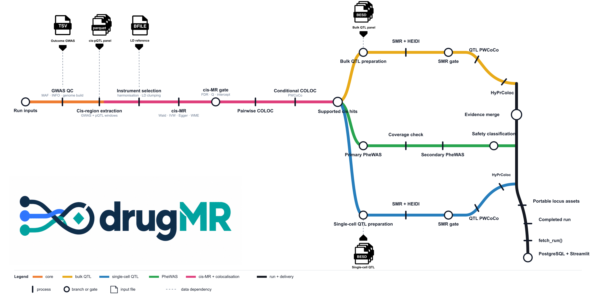

**drugMR: a multi omics pipeline for genetically anchored drug target discovery**

[](LICENSE)
[](https://www.nextflow.io/)
[](pyproject.toml)
[](env/Dockerfile)
[](https://github.com/guillermocomesanacimadevila/drugMR/pkgs/container/drugmr)
[](https://sylabs.io/docs/)
[](sql/schema.sql)
[](dashboard/mr_app.py)
[](https://doi.org/10.5281/zenodo.22706705)

## Introduction

drugMR takes an outcome GWAS and a panel of protein QTLs and returns a ranked, safety screened shortlist of druggable targets, end to end with no manual steps between stages: Mendelian randomisation, colocalisation, SMR, HyPrColoc, then a phenome wide PheWAS safety screen. It runs via a Nextflow pipeline or a Python orchestrator, against any outcome GWAS and any pQTL cohort registered in its dataset manifest. The downstream SMR, PWCoCo and HyPrColoc stages run against bulk or single cell QTL panels of any type, eQTL, sQTL, mQTL or otherwise, for genuine multi-omics triangulation.

## Workflow

[](docs/nf-metro-static.svg)

## Quick start

1. Install Java (required by Nextflow; on HPC, whatever `module load java` or equivalent provides is fine)
2. Install any of [`Docker`](https://docs.docker.com/engine/install/), [`Apptainer`](https://apptainer.org/) or [`Singularity`](https://sylabs.io/singularity/)
3. Install [`PostgreSQL`](https://www.postgresql.org/download/) (`>=16.0`)
4. Download reference data from [`Zenodo`](https://doi.org/10.5281/zenodo.22706705)
5. Prepare the environment with the bootstrap script below, it installs both the pinned Python packages and a matching [`Nextflow`](https://www.nextflow.io/) (`>=26.04.0`), so there's no separate Nextflow install step.
6. For remote result retrieval with `dm.fetch_run()`, install `rsync` on both the local machine and the remote cluster.

```bash
git clone --recurse-submodules https://github.com/guillermocomesanacimadevila/drugMR.git
cd drugMR
./env/bootstrap.sh       # first clone only, or after dependency changes
source env/activate.sh   # every new login or shell

nextflow run /path/to/cloned/drugMR/main.nf -profile docker -params-file params/AD.ukb_ppp.yaml --manifest_path assets/qtl_manifest.csv
```

## Run on your own data

Every `(pheno_id, pqtl_dataset)` pair gets its own params file under `params/`, validated against `params/schema.json`.

```yaml
pheno_id: AD
sumstats: dat/gwas/AD_bellenguez.tsv
n_cases: 39106
n_controls: 401577
pqtl_dataset: ukb_ppp
reference_data:
  ref_bfile: dat/ref/1000G_EUR_Phase3_plink/1000G.EUR.QC.ALL
  liftover_dir: dat/ref/liftover
  gene_annotation: dat/ref/NCBI/NCBI_genes_grch38_with_synonyms.tsv
snp_col: SNP
a1_col: A1
a2_col: A2
beta_col: BETA
se_col: SE
p_col: P
pos_col: BP
chr_col: CHR
af_col: FRQ
genome_build: GRCh38
target_build: GRCh38
run_smr: true
bulk_qtl_datasets: [MetaBrain, GTEx_v10]
sc_qtl_dataset: SingleBrain
```

`pqtl_dataset`, `bulk_qtl_datasets` and `sc_qtl_dataset` must match a dataset registered in `assets/qtl_manifest.csv`. Registering a new one is a new row there, parquet, csv, tsv or txt all work, no code changes.

When a registered QTL dataset has no SMR-format files, drugMR builds them chromosome by chromosome in `synthesis/qtl_esd/`, then moves each complete `.besd`/`.esi`/`.epi` triple into a dataset-specific subdirectory beside the manifest-declared source. That location must be writable. Subsequent phenotypes reuse those files without converting the QTL dataset again.

```bash
nextflow run main.nf \
  -profile <docker,apptainer,singularity,podman,shifter,charliecloud> \
  -params-file <path/to/params.yaml> \
  --manifest_path <path/to/qtl_manifest.csv>
```

After Nextflow completes successfully, its run directory contains `params.lock.yaml`, a snapshot of the effective parameters used for that analysis. Use Python to fetch a remote run when necessary and launch the results dashboard from that snapshot:

```python
import drugmr as dm

config = dm.fetch_run(
    run_id="AD_ukb_ppp_YYYYMMDD_abcdef0",
    user="your_username",
    host="login.your-cluster.ac.uk",
    remote_root="/path/to/drugMR/runs",
)

dm.results(config=config)
```

`dm.fetch_run()` transfers the results, manifest, pipeline reports, and `params.lock.yaml`, then returns the local path to that locked configuration. Skip the fetch when the completed run already exists on the dashboard machine; in that case, pass `runs/<run_id>/params.lock.yaml` directly to `dm.results()`. A locked configuration selects that exact run, while a regular file under `params/` selects the latest successful matching run. Run fetches from a local terminal when SSH needs a password or key passphrase. `dm.results()` starts PostgreSQL with Docker Compose, loads the selected run, and launches Streamlit.

For a local Nextflow run, use either the exact run snapshot or the original params file:

```python
# Open one exact local run
dm.results(config="runs/AD_test_20260911_abcdef0/params.lock.yaml")

# Or open the latest successful run matching this phenotype and pQTL dataset
dm.results(config="params/AD.test.yaml")
```

`dm.results()` always requires `config`; calling it without an argument is not supported.

Full installation, configuration, HPC, fetch, and dashboard instructions are available on the [drugMR documentation site](https://guillermocomesanacimadevila.github.io/drugMR/).

## Pipeline summary

* GWAS QC and cis region extraction
* Cis-MR (Wald ratio, inverse variance weighted)
* Pairwise colocalisation and PWCoCo
* SMR and HEIDI, bulk and single cell QTL panels
* PWCoCo QTL, SNP level pQTL to QTL to GWAS triangulation
* HyPrColoc
* PheWAS (FinnGen, UK Biobank)
* PostgreSQL and an interactive Streamlit dashboard

Gate thresholds live in the optional `gates` block of your params file. See [`docs/RESULTS_SCHEMA.md`](docs/RESULTS_SCHEMA.md) for the results schema.

## Credits

drugMR was written by:

**Guillermo Comesaña Cimadevila**<sup>1,2</sup>, **Marie-Joe Dib**<sup>3</sup>, **Matthew Bracher-Smith**<sup>1</sup>, **Christian Pepler**<sup>2</sup>, **Dervis Salih**<sup>4</sup>, **Nicholas Bray**<sup>2</sup>, **Emily Simmonds**<sup>1</sup>, **Valentina Escott-Price**<sup>1,2</sup>

<sup>1</sup> UK Dementia Research Institute at Cardiff University, Cardiff, UK
<sup>2</sup> MRC Centre for Neuropsychiatric Genetics and Genomics, Cardiff University, Cardiff, UK
<sup>3</sup> Nascent Studio Ltd, London, UK
<sup>4</sup> UK Dementia Research Institute at University College London, London, UK

## Contributions and support

Contributions are welcome. Fork the repository, open a pull request, and flag it to Guillermo (ComesanaCimadevilaG@cardiff.ac.uk).

## Citations

If you use drugMR in your work, please cite it. A machine readable citation is provided in [`CITATION.cff`](CITATION.cff). An extensive list of references for every tool this pipeline depends on is in [`CITATIONS.md`](CITATIONS.md).

## License

Released under the [MIT License](LICENSE).
