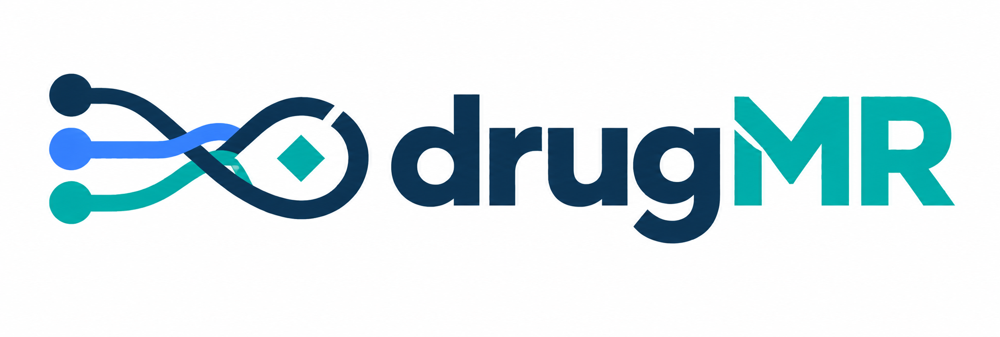
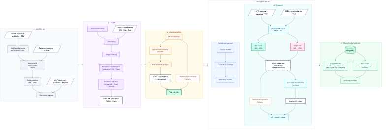

**drugMR: A multi-omics pipeline for genetically-anchored drug target discovery**

[](LICENSE)
[](pyproject.toml)
[](env/Dockerfile)
[](https://github.com/guillermocomesanacimadevila/drugMR/pkgs/container/drugmr)
[](https://apptainer.org/)
[](https://sylabs.io/singularity/)
[](sql/schema.sql)
[](dashboard/mr_app.py)

drugMR takes an outcome GWAS and a panel of protein QTLs and returns a ranked, safety-screened shortlist of druggable targets, run end to end without manual intervention. Each stage (Mendelian randomisation, colocalisation, SMR, HyPrColoc, PheWAS) runs independently and passes forward only the targets that survived the stage before it. The pipeline integrates plasma, CSF and brain pQTLs (over 10,000 proteins; Olink, SomaScan and mass spectrometry) from **UKB-PPP**, **deCODE**, **Wu et al. (CSF)** and **Wingo et al. (brain)**, and any further pQTL dataset a user registers in `assets/qtl_manifest.csv`. It is demonstrated here on Alzheimer's disease but works against any outcome phenotype. Results are loaded into PostgreSQL and served through a Streamlit dashboard.

---

## Contents

- [Pipeline overview](#pipeline-overview)
- [Results schema](docs/RESULTS_SCHEMA.md)
- [Data sources](#data-sources)
- [Repository layout](#repository-layout)
- [Installation](#installation)
- [Configuration](#configuration)
- [Runs, registry & synthesis](#runs-registry--synthesis)
- [Running the pipeline](#running-the-pipeline)
- [Dashboard](#dashboard)
- [Synapse configuration](#synapse-configuration)
- [Streamlit configuration](#streamlit-configuration)
- [HPC (Falcon) access](#hpc-falcon-access)
- [Docker](#docker)
- [Citation](#citation)
- [Authors](#authors)
- [License](#license)

---

## Pipeline overview

Each stage reads the previous stage's output, applies a threshold-like gate, and writes only the survivors forward. The thresholds below are the defaults, but every one of them lives in the `gates:` block of your params file, so you can loosen or tighten them without touching a line of code. Completed stages are cached per-run under `runs/<run_id>/results/` and reused unless `overwrite: true`.




| # | Stage | Script | Gate to next stage |
| --- | --- | --- | --- |
| 1 | GWAS QC | `bin/qc_gwas.py` | Harmonises and QCs the outcome GWAS |
| 2 | cis-region prep | `bin/prep_cis_regions.py` | Matches pQTL cis-regions to the outcome GWAS |
| 3 | cis-MR | `bin/cis_mr.R` | Wald ratio (1 instrument) or IVW (>1 instrument) per protein; passes if `Wald_FDR_q < 0.05`, or `IVW_FDR_q < 0.05` with `Cochran_Q_p > 0.05` |
| 4 | Pairwise COLOC + PWCoCo | `bin/coloc_targets.py`, `bin/pwcoco_wrapper.py` | pQTL-GWAS colocalisation; passes if `PP.H4.abf > 0.7`. PWCoCo runs alongside as a conditional-coloc check for loci with more than one causal signal, not as a replacement |
| 5 | Top cis-hit compilation | `bin/compile_cis_hit_info.py` | Aligns the top cis-SNP per protein to the outcome risk allele |
| 6 | SMR + PWCoCo-QTL | `bin/sort_smr.py`, `bin/pwcoco_qtl_wrapper.py` | eQTL-GWAS colocalisation via SMR + HEIDI, bulk (MetaBrain / GTEx v10) and single-cell (SingleBrain); passes if `q_SMR < 0.05` and `p_HEIDI > 0.01`. PWCoCo-QTL runs alongside as SNP-level pQTL-eQTL-GWAS triangulation |
| 7 | HyPrColoc | `bin/hyprcoloc_targets.py` | Clusters pQTL, GWAS and eQTL signals for SMR-eligible targets to confirm they share one causal variant |
| 8 | PheWAS | `bin/phewas_cis_pqtls.py`, `bin/ukb_phewas.py` | FinnGen and UK Biobank phenome-wide MR safety screen of surviving targets |
| 9 | Results | `dm.results()` | Loads results into PostgreSQL and launches the Streamlit dashboard |

---

## Data sources

Every pQTL and eQTL dataset is registered as one row in `assets/qtl_manifest.csv` (path, column mapping, sample size), so adding a new dataset is a matter of adding a row, not writing new code. The four pQTL cohorts and three eQTL panels below are what is registered today.

| Type | Dataset | Fluid / tissue | Config key |
| --- | --- | --- | --- |
| pQTL | UKB-PPP | Plasma (Olink) | `pqtl_dataset: ukb_ppp` |
| pQTL | deCODE | Plasma (SomaScan) | `pqtl_dataset: decode` |
| pQTL | Wu et al. | CSF | `pqtl_dataset: wu_csf` |
| pQTL | Wingo et al. | Brain | `pqtl_dataset: wingo_brain` |
| Bulk eQTL | MetaBrain, GTEx v10 | Brain (tissue-resolved) | `bulk_eqtl_datasets` |
| Single-cell eQTL | SingleBrain | Brain (cell-type-resolved: Ast, Ext, IN, MG, OD, OPC, End) | `sc_eqtl_dataset` |
| Reference panel | 1000 Genomes (EUR, Phase 3) | N/A | `ref_bfile` |

---

## Repository layout

```
drugMR/
├── drugmr/          # Installable package: Config, paths, registry, SMR, PheWAS, PyTwoSampleMR, utils
├── bin/             # Pipeline stage scripts (Python + R), invoked by drugmr
├── params/          # One params.yaml per (pheno_id, pqtl_dataset), plus schema.json that keeps them honest
├── dat/             # Input data: GWAS, pQTL, sc-eQTL, cis regions, reference panel
│   └── derived/     # Shared preprocessing that every run for a pheno_id reuses (QC'd GWAS)
├── runs/            # One folder per run (results/, manifest.json, params.lock.yaml) + registry.json pointing at "latest"
├── synthesis/       # Cross-dataset roll-ups per pheno_id, once you've run more than one pQTL dataset
├── dashboard/       # Streamlit app (mr_app.py)
├── notebooks/       # Worked examples (00_drugmr.ipynb)
├── assets/          # qtl_manifest.csv (dataset registry) and other run-adjacent bits
├── env/             # Dockerfile, requirements.txt
├── tools/           # Git submodules (pwcoco)
├── docs/            # Pipeline DAG (docs/pipeline_dag.png), results schema (docs/RESULTS_SCHEMA.md)
```

---

## Installation

Requires **Python ≥ 3.12**, and either **Docker** (local runs) or **SLURM + Apptainer** access to an HPC cluster (Falcon).

```bash
git clone --recurse-submodules https://github.com/guillermocomesanacimadevila/drugMR.git
cd drugMR/
pip install -e .
```

(Already cloned without `--recurse-submodules`? Run `git submodule update --init --recursive` from inside the repo.)

### Quickstart (notebook)

No conda needed as the R/PLINK/GCTA/SMR/PWCoCo stack only ever runs inside the Docker image `dm.local()` pulls automatically, so the host only needs Python and Docker.

```bash
chmod +x launch.sh && bash launch.sh
```

First run creates a `.venv`, installs `drugmr` plus Jupyter (`pip install -e ".[notebook]"`), and opens `notebooks/00_drugmr.ipynb` in Jupyter Lab. Every run after that just re-activates the same `.venv` and reopens the notebook, run the same command again any time you want to reuse the pipeline.

---

## Configuration

There is no single `config.yaml`. Every `(pheno_id, pqtl_dataset)` pair gets its own params file under `params/`, for example `params/AD.ukb_ppp.yaml` or `params/AD.wingo_brain.yaml`. The outcome GWAS settings are duplicated across each one (only `pqtl_dataset` and the eQTL fields differ), which looks repetitive but keeps every run's config self-contained and diffable in git. `drugmr.config.Config` validates whatever you point it at against `params/schema.json`, so a mistyped column name fails immediately, rather than three hours into cis-MR.

| Field | Purpose |
| --- | --- |
| `pheno_id`, `sumstats`, `n_cases`, `n_controls` | Outcome GWAS identity and sample size |
| `genome_build`, `target_build` | Source and target genome builds (liftover if they differ) |
| `snp_col` / `a1_col` / `a2_col` / `beta_col` / `se_col` / `p_col` / `pos_col` / `chr_col` / `af_col` | Column names in your outcome GWAS |
| `pqtl_dataset` | Which pQTL dataset to run, matching a dataset registered in `assets/qtl_manifest.csv` |
| `ref_bfile` | Reference panel (1000 Genomes) for cis-MR / SMR |
| `run_smr` | Master on/off switch for the SMR step |
| `bulk_eqtl_datasets` | Pre-computed bulk eQTL datasets to ingest (e.g. `[MetaBrain, GTEx_v10]`); `[]` skips bulk SMR |
| `sc_eqtl_dataset` | Single-cell eQTL dataset to run SMR against (e.g. `SingleBrain`); empty skips single-cell SMR |
| `maf`, `remove_mhc`, `remove_apoe` | QC filters applied to GWAS/pQTLs |
| `overwrite` | Force every stage to rerun instead of reusing existing outputs |
| `gates` | Optional block of per-step statistical thresholds (see below); omit it and the old hardcoded defaults apply |

The `gates` block replaces what used to be hardcoded magic numbers inside `bin/coloc_targets.py`: cis-MR, COLOC and HyPrColoc thresholds are now plain YAML.

```yaml
gates:
  cis_mr:
    wald_fdr_q: 0.05               # FDR-q cutoff for single-instrument (Wald ratio) proteins
    ivw_fdr_q: 0.05                # FDR-q cutoff for multi-instrument (IVW) proteins
    cochran_q_pval: 0.05           # Minimum Cochran's Q p-value (no significant heterogeneity) for IVW proteins
    egger_intercept_pval_min: 0    # Minimum (exclusive) Egger intercept p-value for IVW proteins
    min_instruments_for_ivw: 3     # Instrument count at/above which IVW takes over from Wald ratio
  coloc:
    pp4_threshold: 0.7             # Minimum PP.H4.abf to pass pairwise coloc
  hyprcoloc:
    posterior_prob_thresh: 0.5     # Minimum HyPrColoc posterior probability of 1 shared causal variant
```

---

## Runs, registry & synthesis

Every call to `dm.local()` / `dm.hpc()` gets its own stamped directory `<pheno_id>_<pqtl_dataset>_<date>_<git_sha7>` and lives at:

```
runs/AD_ukb_ppp_20260811_149fc55/
├── results/          # Everything cis-MR, COLOC, SMR and PheWAS wrote for this run
├── manifest.json     # What ran, when, against which commit
└── params.lock.yaml  # A frozen copy of the params file used
```

`runs/registry.json` keeps a `{pheno_id}__{pqtl_dataset} -> {latest, history}` map, and it's only updated once every single step of a run has actually succeeded. So `registry["AD__ukb_ppp"]["latest"]` can never point you at a half-finished run; the dashboard trusts it blindly for exactly that reason. Preprocessing that's shared across every run for a given phenotype (QC'd GWAS) doesn't get needlessly re-run or re-copied per pQTL dataset as it sits once in `dat/derived/<pheno_id>/` and every run for that phenotype just reads it. Once you've run more than one pQTL dataset for the same phenotype, `synthesis/<pheno_id>/` is where the cross-dataset target roll-up belongs (e.g. `all_datasets_mined_targets.tsv`).

---

## Running the pipeline

```python
import drugmr as dm

# run locally via Docker: pick the params file for the (pheno_id, pqtl_dataset) you want
dm.local(config="params/AD.ukb_ppp.yaml")

# OR run on the Falcon HPC cluster via SLURM/Apptainer
dm.hpc(config="params/AD.ukb_ppp.yaml")

# load that run's cis-MR/COLOC results into PostgreSQL and launch the Streamlit dashboard
dm.results(config="params/AD.ukb_ppp.yaml")
```

See [`notebooks/00_drugmr.ipynb`](notebooks/00_drugmr.ipynb) for a worked example.

---

## Dashboard

`dm.results()` launches a Streamlit dashboard (`dashboard/mr_app.py`) with a pQTL dataset selector, a run-history picker (`runs/registry.json`), and sidebar filters (outcome, FDR/Q/PP.H4 thresholds, protein search), shared across:

| Page | Contents |
| --- | --- |
| **Overview** | Target prioritisation funnel and pipeline stage guide; start here |
| **Target Profile** | Full evidence trail for a single target, including a LocusZoom-style regional plot of the GWAS, pQTL and eQTL signals at its locus |
| **Evidence by Stage** | Full per-stage results tables, one sub-tab per pipeline stage: 1. cis-MR, 2. pQTL–GWAS COLOC, 3. FinnGen PheWAS, 4. UKB PheWAS, 5. SMR (bulk/sc eQTL), 6. HyPrColoc (bulk/sc eQTL) |
| **7. Final Targets** | Curated, filter-free deliverable: targets passing every stage, one row per target × cell-type/tissue, with a Sankey diagram showing the full branching (COLOC vs PWCoCo, bulk vs single-cell, HyPrColoc vs PWCoCo-QTL) |
| **PWCoCo (conditional coloc)** | Conditional colocalisation results for loci with more than one causal signal |
| **PWCoCo-QTL (eQTL triangulation)** | SNP-level triangulation across pQTL, eQTL and GWAS for targets not resolved by HyPrColoc |

---

## Synapse configuration

Some pQTL cohorts are distributed via Synapse. Create `~/.synapseConfig`:

```bash
nano ~/.synapseConfig
```

```ini
[default]
username = your_email@example.com
authtoken = YOUR_PERSONAL_ACCESS_TOKEN

[cache]
location = ~/.synapseCache
```

## Streamlit configuration

The dashboard reads results from PostgreSQL via `.streamlit/secrets.toml`, which is gitignored and regenerated automatically by `dm.results()` (it calls `bin/write_streamlit_secrets.py` before launching the dashboard), rather than hand-edited. The generated connection uses the current OS user against a native local PostgreSQL install on port 5432, with no password (trust-authenticated). Edit the constants at the top of `bin/write_streamlit_secrets.py` if your setup differs, or run it directly to regenerate the file on its own:

```bash
python3 bin/write_streamlit_secrets.py
```

## HPC (Falcon) access

For SLURM/Apptainer runs via `dm.hpc()`, configure passwordless SSH to Falcon:

```bash
# generate a key, if you don't already have one
ssh-keygen -t ed25519 -C "drugMR"

# copy it to Falcon
ssh-copy-id c.<username>@falconlogin.cf.ac.uk

# test the connection
ssh c.<username>@falconlogin.cf.ac.uk
```

## Docker

The pipeline image is published to GHCR:

```bash
docker pull ghcr.io/guillermocomesanacimadevila/drugmr:latest
```

`dm.local()` pulls and runs this image automatically. A manual pull is only needed if you're debugging the container itself.

---

## Citation

If you use drugMR in your work, please cite it. See [`CITATION.cff`](CITATION.cff):

```bibtex
@software{drugmr2026,
  title   = {drugMR: A Multi-Fluid Multi-Omics Drug Discovery Pipeline},
  author  = {Comesaña Cimadevila, Guillermo and Dib, Marie-Joe and Salih, Dervis
             and Bray, Nicholas J. and Simmonds, Emily and Escott-Price, Valentina},
  year    = {2026},
  url     = {https://github.com/guillermocomesanacimadevila/drugMR},
  license = {MIT}
}
```

## Authors

**Guillermo Comesaña Cimadevila**<sup>1,2</sup>, **Christian Pepler**<sup>2</sup>, **Marie-Joe Dib**<sup>3</sup>, **Dervis Salih**<sup>4</sup>, **Nicholas J. Bray**<sup>2</sup>, **Emily Simmonds**<sup>1</sup>, **Valentina Escott-Price**<sup>1,2</sup>

<sup>1</sup> UK Dementia Research Institute at Cardiff University, Cardiff, UK
<sup>2</sup> MRC Centre for Neuropsychiatric Genetics and Genomics, Cardiff University, Cardiff, UK
<sup>3</sup> Nascent Studio Ltd, London, UK
<sup>4</sup> UK Dementia Research Institute at University College London, London, UK

## License

Released under the [MIT License](LICENSE).