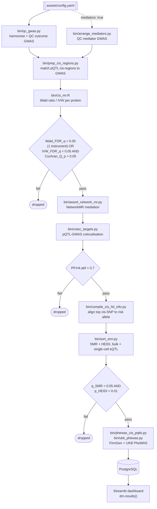

# drugMR

**A multi-fluid, multi-omics pipeline for genetically-anchored drug target discovery**

[](LICENSE)
[](pyproject.toml)
[](https://github.com/guillermocomesanacimadevila/drugMR/pkgs/container/drugmr)

drugMR takes an outcome GWAS and a panel of protein QTLs and returns a ranked, safety-screened list of druggable targets. Every step in between (Mendelian randomisation, colocalisation, SMR, PheWAS) runs automatically and is gated on the evidence produced by the step before it. It integrates plasma, CSF and brain pQTLs (>10,000 proteins; Olink, SomaScan and mass-spec) from **UKB-PPP**, **deCODE**, **Wu et al. (CSF)** and **Wingo et al. (brain)**, tested against any outcome phenotype (demonstrated here on Alzheimer's disease), with optional mediation through intermediate biomarkers such as CSF pTau181 and Aβ42. Results converge in a Streamlit dashboard backed by PostgreSQL.

---

## Contents

- [Pipeline overview](#pipeline-overview)
- [Data sources](#data-sources)
- [Repository layout](#repository-layout)
- [Installation](#installation)
- [Configuration](#configuration)
- [Running the pipeline](#running-the-pipeline)
- [Dashboard](#dashboard)
- [Synapse configuration](#synapse-configuration)
- [Streamlit configuration](#streamlit-configuration)
- [HPC (Falcon) access](#hpc-falcon-access)
- [Docker](#docker)
- [Citation](#citation)
- [Authors](#authors)
- [License](#license)

---

## Pipeline overview

Each stage reads the previous stage's output, applies a hard statistical gate, and writes only the survivors forward. Nothing advances on vibes: the thresholds below are the literal filter conditions in `bin/coloc_targets.py` and `bin/sort_smr.py`. Completed stages are cached under `results/` and reused unless `overwrite: true`.



| # | Stage | Script | Gate to next stage |
| --- | --- | --- | --- |
| 1 | GWAS QC | `bin/qc_gwas.py` | Harmonises and QCs the outcome GWAS |
| 2 | Mediator QC (optional) | `bin/arrange_mediators.py` | QCs mediating biomarker GWAS when `mediators: true` |
| 3 | cis-region prep | `bin/prep_cis_regions.py` | Matches pQTL cis-regions to the outcome GWAS |
| 4 | cis-MR | `bin/cis_mr.R` | Wald ratio (1 instrument) or IVW (>1 instrument) per protein; passes if `Wald_FDR_q < 0.05`, or `IVW_FDR_q < 0.05` with `Cochran_Q_p > 0.05` |
| 5 | NetworkMR (optional) | `bin/assort_network_mr.py` | Mediation analysis through the biomarkers in `mediator_manifest` |
| 6 | Pairwise COLOC | `bin/coloc_targets.py` | pQTL-GWAS colocalisation; passes if `PP.H4.abf > 0.7` |
| 7 | Top cis-hit compilation | `bin/compile_cis_hit_info.py` | Aligns the top cis-SNP per protein to the outcome risk allele |
| 8 | SMR | `bin/sort_smr.py` | eQTL-GWAS colocalisation via SMR + HEIDI, bulk (eQTLGen / MetaBrain / GTEx v10) and single-cell (SingleBrain); passes if `q_SMR < 0.05` and `p_HEIDI > 0.01` |
| 9 | PheWAS | `bin/phewas_cis_pqtls.py`, `bin/ukb_phewas.py` | FinnGen and UK Biobank phenome-wide MR safety screen of surviving targets |
| 10 | Results | `dm.results()` | Loads cis-MR/COLOC results into PostgreSQL and launches the Streamlit dashboard |

---

## Data sources

| Type | Dataset | Fluid / tissue | Config key |
| --- | --- | --- | --- |
| pQTL | UKB-PPP | Plasma (Olink) | `pqtl_dataset: ukb_ppp` |
| pQTL | deCODE | Plasma (SomaScan) | `pqtl_dataset: decode` |
| pQTL | Wu et al. | CSF | `pqtl_dataset: wu_csf` |
| pQTL | Wingo et al. | Brain | `pqtl_dataset: wingo_brain` |
| Bulk eQTL | eQTLGen, MetaBrain, GTEx v10 | Blood / brain (tissue-resolved) | `bulk_eqtl_datasets` |
| Single-cell eQTL | SingleBrain | Brain (cell-type-resolved: Ast, Ext, IN, MG, OD, OPC, End) | `sc_eqtl_dataset` |
| Reference panel | 1000 Genomes (EUR, Phase 3) | N/A | `ref_bfile` |

---

## Repository layout

```
drugMR/
├── drugmr/          # Installable package: Config, SMR, PheWAS, NetworkMR, PyTwoSampleMR, utils
├── bin/             # Pipeline stage scripts (Python + R), invoked by drugmr
├── scripts/         # Per-cohort data ingestion/preprocessing (deCODE, UKB-PPP, Wu CSF, Wingo, SingleBrain)
├── dat/             # Input data: GWAS, pQTL, sc-eQTL, cis regions, reference panel
├── results/         # Pipeline outputs: cis-MR, COLOC, SMR, PheWAS, target stats
├── dashboard/       # Streamlit app (mr_app.py)
├── notebooks/       # Worked examples (00_drugmr.ipynb)
├── assets/          # config.yaml, mediator manifests
├── env/             # Dockerfile, requirements.txt
├── modules/         # Git submodules (ukbppp_dl)
```

---

## Installation

Requires **Python ≥ 3.12**, and either **Docker** (local runs) or **SLURM + Apptainer** access to an HPC cluster (Falcon).

```bash
git clone https://github.com/guillermocomesanacimadevila/drugMR.git
cd drugMR/
pip install -e .
```

---

## Configuration

Every run is driven by `assets/config.yaml`.

| Field | Purpose |
| --- | --- |
| `pheno_id`, `sumstats`, `n_cases`, `n_controls` | Outcome GWAS identity and sample size |
| `genome_build`, `target_build` | Source and target genome builds (liftover if they differ) |
| `snp_col` / `a1_col` / `a2_col` / `beta_col` / `se_col` / `p_col` / `pos_col` / `chr_col` / `af_col` | Column names in your outcome GWAS |
| `pqtl_dataset`, `pqtl_dir` | Which pQTL dataset to run (`ukb_ppp`, `decode`, `wu_csf`, `wingo_brain`) |
| `ref_bfile` | Reference panel (1000 Genomes) for cis-MR / SMR |
| `mediators`, `mediator_manifest` | Enable mediation analysis through a manifest of biomarkers |
| `run_smr` | Master on/off switch for the SMR step |
| `bulk_eqtl_datasets` | Pre-computed bulk eQTL datasets to ingest (e.g. `[eQTLGen, MetaBrain, GTEx_v10]`); `[]` skips bulk SMR |
| `sc_eqtl_dataset` | Single-cell eQTL dataset to run SMR against (e.g. `SingleBrain`); empty skips single-cell SMR |
| `maf`, `remove_mhc`, `remove_apoe` | QC filters applied to GWAS/pQTLs |
| `overwrite` | Force every stage to rerun instead of reusing existing outputs |

---

## Running the pipeline

```python
import drugmr as dm

# run locally via Docker
dm.local(config="assets/config.yaml")

# OR run on the Falcon HPC cluster via SLURM/Apptainer
dm.hpc(config="assets/config.yaml")

# load cis-MR/COLOC results into PostgreSQL and launch the Streamlit dashboard
dm.results()
```

See [`notebooks/00_drugmr.ipynb`](notebooks/00_drugmr.ipynb) for a worked example.

---

## Dashboard

`dm.results()` launches a Streamlit dashboard (`dashboard/mr_app.py`) with a pQTL dataset selector and sidebar filters (outcome, FDR/Q/PP.H4 thresholds, protein search), shared across:

| Page | Contents |
| --- | --- |
| **Overview** | Target prioritisation funnel (cis-MR → cis-MR + COLOC) and the prioritised target table |
| **1. cis-MR** | Full cis-MR association table and a volcano plot |
| **2. pQTL-GWAS COLOC** | Targets passing both cis-MR and pairwise COLOC thresholds |
| **3. FinnGen PheWAS** / **4. UKB PheWAS** | Per-target phenome-wide MR safety profile, Manhattan-style scatter, Bonferroni-significant associations |
| **5. SMR (bulk/sc eQTL)** | Filterable SMR + HEIDI results (by data type / cell type), plus a target × cell-type/tissue support heatmap |
| **6. Final Targets** | Curated, filter-free deliverable: targets passing cis-MR + COLOC + SMR + HEIDI, one row per target × cell-type/tissue, GWAS/pQTL/eQTL/SMR betas aligned to the outcome risk allele, top SMR SNP (chromosome/position), SMR/HEIDI p-values |

---

## Synapse configuration

Some pQTL cohorts are distributed via Synapse. Create `~/.synapseConfig`:

```bash
nano ~/.synapseConfig
```

```ini
[default]
username = your_email@example.com
authtoken = YOUR_PERSONAL_ACCESS_TOKEN

[cache]
location = ~/.synapseCache
```

## Streamlit configuration

The dashboard reads results from PostgreSQL. Create `.streamlit/secrets.toml`:

```bash
nano .streamlit/secrets.toml
```

```toml
[connections.postgresql]
dialect = "postgresql"
host = "localhost"
port = "5432"
database = "xxx"
username = "xxx"
password = "xxx"
```

## HPC (Falcon) access

For SLURM/Apptainer runs via `dm.hpc()`, configure passwordless SSH to Falcon:

```bash
# generate a key, if you don't already have one
ssh-keygen -t ed25519 -C "drugMR"

# copy it to Falcon
ssh-copy-id c.<username>@falconlogin.cf.ac.uk

# test the connection
ssh c.<username>@falconlogin.cf.ac.uk
```

## Docker

The pipeline image is published to GHCR:

```bash
docker pull ghcr.io/guillermocomesanacimadevila/drugmr:latest
```

`dm.local()` pulls and runs this image automatically. A manual pull is only needed if you're debugging the container itself.

---

## Citation

If you use drugMR in your work, please cite it. See [`CITATION.cff`](CITATION.cff):

```bibtex
@software{drugmr2026,
  title   = {drugMR: A Multi-Fluid Multi-Omics Drug Discovery Pipeline},
  author  = {Comesaña Cimadevila, Guillermo and Dib, Marie-Joe and Salih, Dervis
             and Bray, Nicholas J. and Simmonds, Emily and Escott-Price, Valentina},
  year    = {2026},
  url     = {https://github.com/guillermocomesanacimadevila/drugMR},
  license = {MIT}
}
```

## Authors

**Guillermo Comesaña Cimadevila**<sup>1,2</sup>, **Marie-Joe Dib**<sup>3</sup>, **Dervis Salih**<sup>4</sup>, **Nicholas J. Bray**<sup>2</sup>, **Emily Simmonds**<sup>1</sup>, **Valentina Escott-Price**<sup>1,2</sup>

<sup>1</sup> UK Dementia Research Institute at Cardiff University, Cardiff, UK
<sup>2</sup> MRC Centre for Neuropsychiatric Genetics and Genomics, Cardiff University, Cardiff, UK
<sup>3</sup> Nascent Studio Ltd, London, UK
<sup>4</sup> UK Dementia Research Institute at University College London, London, UK

## License

Released under the [MIT License](LICENSE).
