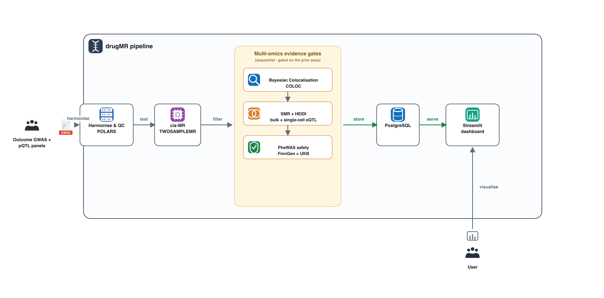

# drugMR

**A multi-fluid, multi-omics pipeline for genetically-anchored drug target discovery**

[](LICENSE)
[](pyproject.toml)
[](https://github.com/guillermocomesanacimadevila/drugMR/pkgs/container/drugmr)

drugMR takes an outcome GWAS and a panel of protein QTLs and hands you back a ranked, safety-screened shortlist of druggable targets — no manual babysitting required. Every step in between (Mendelian randomisation, colocalisation, SMR, PheWAS) runs on its own and only lets through what the previous step actually earned. It integrates plasma, CSF and brain pQTLs (>10,000 proteins; Olink, SomaScan and mass-spec) from **UKB-PPP**, **deCODE**, **Wu et al. (CSF)** and **Wingo et al. (brain)**, tested against any outcome phenotype (demonstrated here on Alzheimer's disease), with optional mediation through intermediate biomarkers such as CSF pTau181 and Aβ42. Results converge in a Streamlit dashboard backed by PostgreSQL.

---

## Contents

- [Pipeline overview](#pipeline-overview)
- [Results schema](docs/RESULTS_SCHEMA.md)
- [Data sources](#data-sources)
- [Repository layout](#repository-layout)
- [Installation](#installation)
- [Configuration](#configuration)
- [Runs, registry & synthesis](#runs-registry--synthesis)
- [Running the pipeline](#running-the-pipeline)
- [Dashboard](#dashboard)
- [Synapse configuration](#synapse-configuration)
- [Streamlit configuration](#streamlit-configuration)
- [HPC (Falcon) access](#hpc-falcon-access)
- [Docker](#docker)
- [Citation](#citation)
- [Authors](#authors)
- [License](#license)

---

## Pipeline overview

Each stage reads the previous stage's output, applies a hard statistical gate, and writes only the survivors forward. Nothing advances on vibes: the thresholds below are the defaults, but every one of them lives in the `gates:` block of your params file, so you can loosen or tighten them without touching a line of code. Completed stages are cached per-run under `runs/<run_id>/results/` and reused unless `overwrite: true`.




| # | Stage | Script | Gate to next stage |
| --- | --- | --- | --- |
| 1 | GWAS QC | `bin/qc_gwas.py` | Harmonises and QCs the outcome GWAS |
| 2 | Mediator QC (optional) | `bin/arrange_mediators.py` | QCs mediating biomarker GWAS when `mediators: true` |
| 3 | cis-region prep | `bin/prep_cis_regions.py` | Matches pQTL cis-regions to the outcome GWAS |
| 4 | cis-MR | `bin/cis_mr.R` | Wald ratio (1 instrument) or IVW (>1 instrument) per protein; passes if `Wald_FDR_q < 0.05`, or `IVW_FDR_q < 0.05` with `Cochran_Q_p > 0.05` |
| 5 | NetworkMR (optional) | `bin/assort_network_mr.py` | Mediation analysis through the biomarkers in `mediator_manifest` |
| 6 | Pairwise COLOC | `bin/coloc_targets.py` | pQTL-GWAS colocalisation; passes if `PP.H4.abf > 0.7` |
| 7 | Top cis-hit compilation | `bin/compile_cis_hit_info.py` | Aligns the top cis-SNP per protein to the outcome risk allele |
| 8 | SMR | `bin/sort_smr.py` | eQTL-GWAS colocalisation via SMR + HEIDI, bulk (eQTLGen / MetaBrain / GTEx v10) and single-cell (SingleBrain); passes if `q_SMR < 0.05` and `p_HEIDI > 0.01` |
| 9 | PheWAS | `bin/phewas_cis_pqtls.py`, `bin/ukb_phewas.py` | FinnGen and UK Biobank phenome-wide MR safety screen of surviving targets |
| 10 | Results | `dm.results()` | Loads cis-MR/COLOC results into PostgreSQL and launches the Streamlit dashboard |

---

## Data sources

| Type | Dataset | Fluid / tissue | Config key |
| --- | --- | --- | --- |
| pQTL | UKB-PPP | Plasma (Olink) | `pqtl_dataset: ukb_ppp` |
| pQTL | deCODE | Plasma (SomaScan) | `pqtl_dataset: decode` |
| pQTL | Wu et al. | CSF | `pqtl_dataset: wu_csf` |
| pQTL | Wingo et al. | Brain | `pqtl_dataset: wingo_brain` |
| Bulk eQTL | eQTLGen, MetaBrain, GTEx v10 | Blood / brain (tissue-resolved) | `bulk_eqtl_datasets` |
| Single-cell eQTL | SingleBrain | Brain (cell-type-resolved: Ast, Ext, IN, MG, OD, OPC, End) | `sc_eqtl_dataset` |
| Reference panel | 1000 Genomes (EUR, Phase 3) | N/A | `ref_bfile` |

---

## Repository layout

```
drugMR/
├── drugmr/          # Installable package: Config, paths, registry, SMR, PheWAS, NetworkMR, PyTwoSampleMR, utils
├── bin/             # Pipeline stage scripts (Python + R), invoked by drugmr
├── scripts/         # Per-cohort data ingestion/preprocessing (deCODE, UKB-PPP, Wu CSF, Wingo, SingleBrain)
├── params/          # One params.yaml per (pheno_id, pqtl_dataset), plus schema.json that keeps them honest
├── dat/             # Input data: GWAS, pQTL, sc-eQTL, cis regions, reference panel
│   └── derived/     # Shared preprocessing that every run for a pheno_id reuses (QC'd GWAS, mediator QC)
├── runs/            # One folder per run (results/, manifest.json, params.lock.yaml) + registry.json pointing at "latest"
├── synthesis/       # Cross-dataset roll-ups per pheno_id, once you've run more than one pQTL dataset
├── dashboard/       # Streamlit app (mr_app.py)
├── notebooks/       # Worked examples (00_drugmr.ipynb)
├── assets/          # Mediator manifests and other run-adjacent bits
├── env/             # Dockerfile, requirements.txt
├── modules/         # Git submodules (ukbppp_dl)
├── docs/            # Pipeline DAG (docs/pipeline_dag.png), results schema (docs/RESULTS_SCHEMA.md)
```

---

## Installation

Requires **Python ≥ 3.12**, and either **Docker** (local runs) or **SLURM + Apptainer** access to an HPC cluster (Falcon).

```bash
git clone https://github.com/guillermocomesanacimadevila/drugMR.git
cd drugMR/
pip install -e .
```

---

## Configuration

There's no single `config.yaml` to rule them all any more — every `(pheno_id, pqtl_dataset)` pair gets its own params file under `params/`, e.g. `params/AD.ukb_ppp.yaml`, `params/AD.wingo_brain.yaml`. Same outcome GWAS settings copy-pasted across each one (only `pqtl_dataset`/`pqtl_dir` differ), which looks repetitive but means each run's config is self-contained and diffable in git. `drugmr.config.Config` validates whatever you point it at against `params/schema.json`, so a typo'd column name fails loudly before anything expensive runs, instead of three hours into cis-MR.

| Field | Purpose |
| --- | --- |
| `pheno_id`, `sumstats`, `n_cases`, `n_controls` | Outcome GWAS identity and sample size |
| `genome_build`, `target_build` | Source and target genome builds (liftover if they differ) |
| `snp_col` / `a1_col` / `a2_col` / `beta_col` / `se_col` / `p_col` / `pos_col` / `chr_col` / `af_col` | Column names in your outcome GWAS |
| `pqtl_dataset`, `pqtl_dir` | Which pQTL dataset to run (`ukb_ppp`, `decode`, `wu_csf`, `wingo_brain`) |
| `ref_bfile` | Reference panel (1000 Genomes) for cis-MR / SMR |
| `mediators`, `mediator_manifest` | Enable mediation analysis through a manifest of biomarkers |
| `run_smr` | Master on/off switch for the SMR step |
| `bulk_eqtl_datasets` | Pre-computed bulk eQTL datasets to ingest (e.g. `[eQTLGen, MetaBrain, GTEx_v10]`); `[]` skips bulk SMR |
| `sc_eqtl_dataset` | Single-cell eQTL dataset to run SMR against (e.g. `SingleBrain`); empty skips single-cell SMR |
| `maf`, `remove_mhc`, `remove_apoe` | QC filters applied to GWAS/pQTLs |
| `overwrite` | Force every stage to rerun instead of reusing existing outputs |
| `gates` | Optional block of per-step statistical thresholds (see below) — leave it out and you get the old hardcoded defaults |

The `gates` block is the fun new bit: cis-MR/COLOC/NetworkMR thresholds used to be buried as magic numbers inside `bin/coloc_targets.py`; now they're just YAML.

```yaml
gates:
  cis_mr:
    wald_fdr_q: 0.05              # FDR-q cutoff for single-instrument (Wald ratio) proteins
    ivw_fdr_q: 0.05                # FDR-q cutoff for multi-instrument (IVW) proteins
    cochran_q_pval: 0.05           # Minimum Cochran's Q p-value (no significant heterogeneity) for IVW proteins
    egger_intercept_pval_min: 0    # Minimum (exclusive) Egger intercept p-value for IVW proteins
    min_instruments_for_ivw: 3     # Instrument count at/above which IVW takes over from Wald ratio
  coloc:
    pp4_threshold: 0.7             # Minimum PP.H4.abf to pass pairwise coloc
  network_mr:
    m_y_pval_threshold: 0.05       # Max mediator -> outcome p-value to carry a mediator into NetworkMR
```

Old-school `assets/config.yaml` still works fine if you happen to have one lying around — it validates against the same schema, it just won't have a `gates` block, so it quietly falls back to the defaults above.

---

## Runs, registry & synthesis

Every call to `dm.local()` / `dm.hpc()` gets its own tidy little folder instead of dumping everything into one shared `results/` and hoping nothing clobbers anything else. A run is stamped `<pheno_id>_<pqtl_dataset>_<date>_<git_sha7>` and lives at:

```
runs/AD_ukb_ppp_20260811_149fc55/
├── results/          # Everything cis-MR, COLOC, SMR and PheWAS wrote for this run
├── manifest.json     # What ran, when, against which commit
└── params.lock.yaml  # A frozen copy of the params file used, so you can always answer "what config made this?"
```

`runs/registry.json` keeps a `{pheno_id}__{pqtl_dataset} -> {latest, history}` map, and — this is the important bit — it's only updated once every single step of a run has actually succeeded. So `registry["AD__ukb_ppp"]["latest"]` can never point you at a half-finished run; the dashboard trusts it blindly for exactly that reason.

Preprocessing that's shared across every run for a given phenotype (QC'd GWAS, mediator QC) doesn't get needlessly re-run or re-copied per pQTL dataset — it sits once in `dat/derived/<pheno_id>/` and every run for that phenotype just reads it.

Once you've run more than one pQTL dataset for the same phenotype, `synthesis/<pheno_id>/` is where the cross-dataset target roll-up belongs (e.g. `all_datasets_mined_targets.tsv`) — the one place that legitimately needs to look across `ukb_ppp`, `decode`, `wu_csf` and `wingo_brain` at once rather than living inside any single run.

---

## Running the pipeline

```python
import drugmr as dm

# run locally via Docker — pick the params file for the (pheno_id, pqtl_dataset) you want
dm.local(config="params/AD.ukb_ppp.yaml")

# OR run on the Falcon HPC cluster via SLURM/Apptainer
dm.hpc(config="params/AD.ukb_ppp.yaml")

# load that run's cis-MR/COLOC results into PostgreSQL and launch the Streamlit dashboard
dm.results(config="params/AD.ukb_ppp.yaml")
```

There's no default `config` any more — with one params file per `(pheno_id, pqtl_dataset)` pair, there's no longer a single "correct" file to fall back to, so you have to say which one you mean.

See [`notebooks/00_drugmr.ipynb`](notebooks/00_drugmr.ipynb) for a worked example.

---

## Dashboard

`dm.results()` launches a Streamlit dashboard (`dashboard/mr_app.py`) with a pQTL dataset selector, a run-history picker (courtesy of `runs/registry.json` — no more guessing which `results/` folder is the "real" one), and sidebar filters (outcome, FDR/Q/PP.H4 thresholds, protein search), shared across:

| Page | Contents |
| --- | --- |
| **Overview** | Target prioritisation funnel (cis-MR → cis-MR + COLOC) and the prioritised target table |
| **1. cis-MR** | Full cis-MR association table and a volcano plot |
| **2. pQTL-GWAS COLOC** | Targets passing both cis-MR and pairwise COLOC thresholds |
| **3. FinnGen PheWAS** / **4. UKB PheWAS** | Per-target phenome-wide MR safety profile, Manhattan-style scatter, Bonferroni-significant associations |
| **5. SMR (bulk/sc eQTL)** | Filterable SMR + HEIDI results (by data type / cell type), plus a target × cell-type/tissue support heatmap |
| **6. Final Targets** | Curated, filter-free deliverable: targets passing cis-MR + COLOC + SMR + HEIDI, one row per target × cell-type/tissue, GWAS/pQTL/eQTL/SMR betas aligned to the outcome risk allele, top SMR SNP (chromosome/position), SMR/HEIDI p-values |

---

## Synapse configuration

Some pQTL cohorts are distributed via Synapse. Create `~/.synapseConfig`:

```bash
nano ~/.synapseConfig
```

```ini
[default]
username = your_email@example.com
authtoken = YOUR_PERSONAL_ACCESS_TOKEN

[cache]
location = ~/.synapseCache
```

## Streamlit configuration

The dashboard reads results from PostgreSQL. Create `.streamlit/secrets.toml`:

```bash
nano .streamlit/secrets.toml
```

```toml
[connections.postgresql]
dialect = "postgresql"
host = "localhost"
port = "5432"
database = "xxx"
username = "xxx"
password = "xxx"
```

## HPC (Falcon) access

For SLURM/Apptainer runs via `dm.hpc()`, configure passwordless SSH to Falcon:

```bash
# generate a key, if you don't already have one
ssh-keygen -t ed25519 -C "drugMR"

# copy it to Falcon
ssh-copy-id c.<username>@falconlogin.cf.ac.uk

# test the connection
ssh c.<username>@falconlogin.cf.ac.uk
```

## Docker

The pipeline image is published to GHCR:

```bash
docker pull ghcr.io/guillermocomesanacimadevila/drugmr:latest
```

`dm.local()` pulls and runs this image automatically. A manual pull is only needed if you're debugging the container itself.

---

## Citation

If you use drugMR in your work, please cite it. See [`CITATION.cff`](CITATION.cff):

```bibtex
@software{drugmr2026,
  title   = {drugMR: A Multi-Fluid Multi-Omics Drug Discovery Pipeline},
  author  = {Comesaña Cimadevila, Guillermo and Dib, Marie-Joe and Salih, Dervis
             and Bray, Nicholas J. and Simmonds, Emily and Escott-Price, Valentina},
  year    = {2026},
  url     = {https://github.com/guillermocomesanacimadevila/drugMR},
  license = {MIT}
}
```

## Authors

**Guillermo Comesaña Cimadevila**<sup>1,2</sup>, **Marie-Joe Dib**<sup>3</sup>, **Dervis Salih**<sup>4</sup>, **Nicholas J. Bray**<sup>2</sup>, **Emily Simmonds**<sup>1</sup>, **Valentina Escott-Price**<sup>1,2</sup>

<sup>1</sup> UK Dementia Research Institute at Cardiff University, Cardiff, UK
<sup>2</sup> MRC Centre for Neuropsychiatric Genetics and Genomics, Cardiff University, Cardiff, UK
<sup>3</sup> Nascent Studio Ltd, London, UK
<sup>4</sup> UK Dementia Research Institute at University College London, London, UK

## License

Released under the [MIT License](LICENSE).
