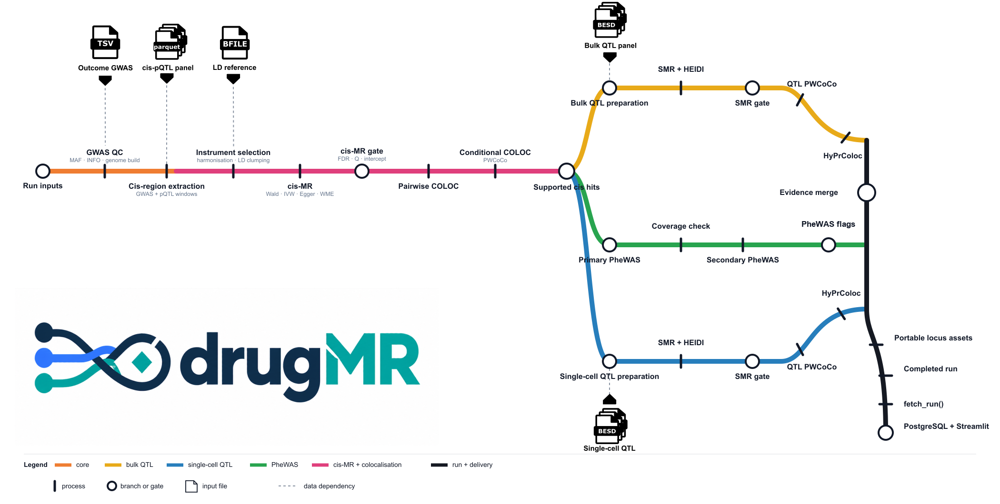

# drugMR

## Overview

**drugMR** is a multi-omics pipeline for genetically anchored drug-target discovery. It takes an outcome GWAS and one protein QTL panel per run, and produces evidence tables and an interactive dashboard for each candidate target, including associations that suggest potential adverse effects or repurposing opportunities. The pipeline is built in [Nextflow](https://www.nextflow.io) DSL2 and runs inside Docker, Apptainer or Singularity containers for reproducible execution. One run combines cis-Mendelian randomisation, colocalisation, SMR and HEIDI, PWCoCo, HyPrColoc and a phenome-wide screen; several panels are analysed in separate runs.

## Documentation

- [Install](getting-started.md): set up the pinned environment and choose a container runtime.
- [Try the demo](getting-started.md#try-the-demo): run every stage in a few minutes on a small synthetic [dataset](https://doi.org/10.5281/zenodo.22917384).
- [Configure a run](configuration.md): define an outcome GWAS, register QTL datasets, and set analysis thresholds.
- [Run the pipeline](running.md): launch and monitor an analysis.
- [Results and dashboard](results-dashboard.md): fetch completed runs, load PostgreSQL, and explore the Streamlit dashboard. `notebooks/00_drugmr.ipynb` provides a worked notebook version of this same step.
- [Output schema](RESULTS_SCHEMA.md): column reference for every results TSV.
- [Troubleshooting](troubleshooting.md): diagnose SLURM, memory, paths, containers, and interrupted runs.
- [Reach out](reach-out.md): points of contact in case any issue arises.

## Workflow

[](nf-metro-static.svg)

1. Quality-control the outcome GWAS and extract the cis region for each protein.
2. Run cis-MR using the selected pQTL panel (this can take several hours).
3. Run pairwise COLOC and conditional PWCoCo between the pQTL and outcome GWAS.
4. Screen colocalisation-supported targets in FinnGen, with UK Biobank as a fallback, for potential adverse effects and repurposing opportunities.
5. Triangulate targets with bulk and single-cell QTL data using SMR and HEIDI.
6. Run QTL PWCoCo and HyPrColoc across the pQTL, QTL and outcome GWAS signals.
7. Save the completed run under `runs/<run_id>/`, then load it into PostgreSQL and explore it in the Streamlit dashboard.

## Choose where each part runs

**drugMR** can run across different compute environments using Nextflow profiles, including locally, on HPC, or on AWS Batch and GCP Batch. The results dashboard runs on a machine with Docker Compose, normally the local computer.

| Situation | What to do |
| --- | --- |
| Pipeline and dashboard on one machine | Run Nextflow, then pass the run's `params.lock.yaml` to `dm.results()`. |
| Pipeline on HPC, dashboard on your computer | Run Nextflow on HPC, fetch the completed run with `dm.fetch_run()`, then call `dm.results(config=config)` locally with Docker running. |
| Pipeline on AWS or GCP Batch, dashboard on your computer | Run Nextflow with `-profile aws` or `-profile gcp` and a bucket `-work-dir`, fetch the completed run, then call `dm.results(config=config)` locally. |

```{note}
`dm.fetch_run()` is only needed when the Nextflow run is on a remote HPC or cloud machine and the dashboard will run elsewhere. It transfers the run's locked parameter snapshot along with its results.

`dm.results()` always needs a configuration. For an exact local run, use `dm.results(config="runs/<run_id>/params.lock.yaml")`. To select the latest successful run matching a regular parameter file, use `dm.results(config="params/<file>.yaml")`.
```

```{toctree}
:maxdepth: 2
:caption: Getting started
:hidden:

getting-started
configuration
running
```

```{toctree}
:maxdepth: 2
:caption: Reference
:hidden:

results-dashboard
RESULTS_SCHEMA
troubleshooting
reach-out
```
